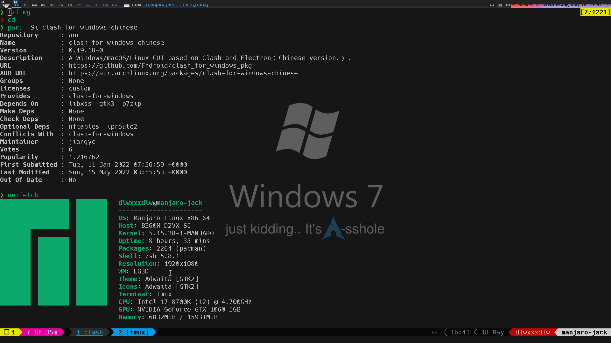

# Awesome Tools Managed By [Chezmoi](https://chezmoi.io/) On [Manjaro](https://manjaro.org/)

## [Chezmoi](https://chezmoi.io/)
Chezmoi manages this repository and itself. Some files are encrypted with gpg.
## [Qtile](http://www.qtile.org/)
A full-featured, hackable tiling window manager written and configured in Python.

[Here's my config and what it looks like](./dot_config/qtile/config.py)


## [Oh My Zsh](https://ohmyz.sh/)
Oh My Zsh is a delightful, open source, community-driven framework for managing your Zsh configuration. 
## [Oh My Tmux](https://github.com/gpakosz/.tmux)
Just like Oh My Zsh, but a pretty & versatile tmux configuration made with ❤️.

## [Syncthing](https://syncthing.net/)
Open Source Continuous Replication / Cluster Synchronization Thing.

Synchronize important code, files, directories from your PC to your laptop in the same local area network.

## [Rofi](https://github.com/davatorium/rofi)
Rofi: A window switcher, application launcher and dmenu replacement.

- [rofi-translate](https://github.com/garyparrot/rofi-translate)
- [rofi-backlight](https://github.com/adi1090x/rofi/blob/master/720p/applets/applets/backlight.sh)
- [rofi-systemd](https://github.com/IvanMalison/rofi-systemd.git)
- [rofi-bluetooth](https://github.com/ClydeDroid/rofi-bluetooth)
- [rofi-wifi-menu](https://github.com/zbaylin/rofi-wifi-menu)
- [rofi-emoji](https://github.com/Mange/rofi-emoji)
- [rofi-greenclip](https://github.com/erebe/greenclip)

## [fzf](https://github.com/junegunn/fzf)
fzf is a general-purpose command-line fuzzy finder.

- [forgit](https://github.com/wfxr/forgit):
  A utility tool powered by fzf for using git interactively.
- [tmux-fzf](https://github.com/sainnhe/tmux-fzf):
  Use fzf to manage your tmux work environment!
- [sysz](https://github.com/joehillen/sysz):
  An fzf terminal UI for systemctl.

## [teiler](https://github.com/carnager/teiler)
Little script for screenshots and screencasts utilizing rofi, maim, ffmpeg.

## [himalaya](https://github.com/soywod/himalaya)
Command-line interface for email management.
- [mail.zsh](./mail.zsh): A TUI from [here](https://github.com/soywod/himalaya/issues/24)

## [ytfzf](https://github.com/pystardust/ytfzf)
A posix script to find and watch YouTube videos from the terminal. (Without API).

Can use this to just play audio.

## [LunarVim](https://www.lunarvim.org/)

My favorite editor with lots of cool features and can work perfectly with lazygit.

## [Lazygit](https://github.com/jesseduffield/lazygit)
Simple terminal UI for git commands. Make life with git happier.

## [bpytop](https://github.com/aristocratos/bpytop)

I think it's a better alternative than Htop.

## [qutebrowser](https://github.com/qutebrowser/qutebrowser)
qutebrowser is a keyboard-focused browser with a minimal GUI. 
It’s based on Python and Qt and free software, licensed under the GPL.

## [rclone](https://github.com/rclone/rclone)
"rsync for cloud storage"

With rclone you can synchronize files from cloud storage like:
Google Drive, S3, Dropbox, Backblaze B2, One Drive, Swift, Hubic, Wasabi, Google Cloud Storage, Yandex Files
to local disk storage. 

## [KeePass & related staff](https://keepass.info/)
KeePass is a aasy-to-use password manager for Windows, Linux, Mac OS X and mobile devices.
- [passhole](https://github.com/Evidlo/passhole): KeePass CLI + dmenu interface, it can input credentials or 2fa through selection on rofi or dmenu.
  ```shell
  ph --config ~/.passhole.ini type --prog 'rofi -dmenu' --tabbed
  ph --config ~/.passhole.ini type --prog 'rofi -dmenu' --totp
  ph --config ~/.passhole.ini type --help
  ```
- [keeweb](https://keeweb.info): Desktop password manager compatible with KeePass databases
- [qute-keepass](https://raw.githubusercontent.com/qutebrowser/qutebrowser/master/misc/userscripts/qute-keepass): A qutebrowser user script to fill credentials from keepass databases automatically.
- [keepass2android](https://github.com/PhilippC/keepass2android): KeePass for android, of course you can install it from google play store.
